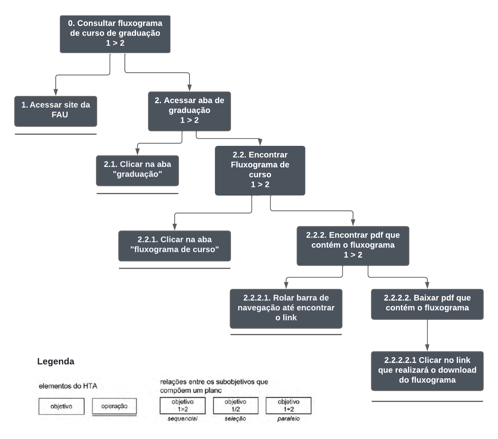
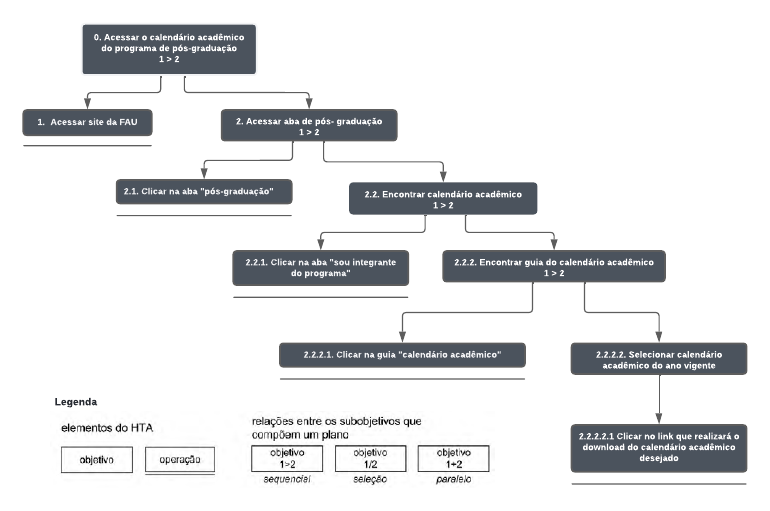

# Análise de Tarefas
***

## Histórico de Versões

**Data** | **Versão** | **Descrição** | **Autor(es/as)** | **Revisor**|
--- | --- | --- | --- | --- |
14/07/2022 | 0.1 | Criação do Documento | Mateus Franco | Caio César |
19/07/2022 | 0.2 | Inserção dos diagrama e tabela | Mateus Franco | Caio César |
29/07/2022 | 0.3 | Adição e padronização de fontes nas figuras e correção de links | Thalisson Alves | Letícia Aires
16/08/2022 | 0.4 | Alterações na estrutura e layout | Mateus Franco | Caio César
16/08/2022 | 0.5 | Inclusão da tarefa de acesso ao calendário acadêmico de pós-graduação | Mateus Franco | Caio César

## 1. Introdução

Uma tarefa é qualquer parte do trabalho que precisa ser realizada e pode ser definida em termo de seus objetivos. A análise de tarefas é baseada na psicologia funcional e é importante para se ter um entendimento dos objetivos que os usuários desejam ou precisam atingir, como eles realizam as tarefas em busca desses objetivos e o por quê. 

Como o objetivo principal é a avaliação de um sistema computacional já existente, a análise de tarefas será realizada através do método de _Análise Hierárquica de Tarefas_. 

Tal método foi escolhido para a análise, pois ela facilita a ilustração de tarefas do sistema, separando-as em objetivos, subobjetivos e operações e os relacionando de diferentes maneiras em relação a como as tarefas devem ser executadas pelo usuário.

## 2. Passos para a realização da Análise de Tarefas

1. Realiza-se a coleta de um conjunto de objetivos, definidos em termos psicológicos, ou seja, os objetivos das pessoas.

2. Para cada objetivo definido anteriormente, elabora-se uma lista das ações realizadas por um agente para alcançar esse objetivo.

3. Verifique a validade da decomposição junto aos stakeholders.

## 3. Análise Hierárquica de Tarefas (AHT)

A Análise Hierárquica de Tarefas examina primeiramente os objetivos de alto nível, decompondo-os em subobjetivos buscando identificar quais subobjetivos são mais difíceis de atingir (ou que geram mais erros) e que, portanto, limitam ou mesmo impedem o atingimento do objetivo maior.

Os subobjetivos de um objetivo e as relações entre eles é denominada de plano. Um plano define os subobjetivos necessários para alcançar um outro objetivo maior, e a ordem em que esses subobjetivos devem ser alcançados.

## 4. Tarefas

### 4.1 Consulta de fluxograma para o curso de graduação

A tarefa permite que o graduando tenha acesso às disciplinas que contém os cursos de graduação e que são obrigatórias para a conclusão do curso.

##### Representação gráfica

Abaixo, representado pela _Figura 1_, está sendo analisado, graficamente, quais são os objetivos e os passos necessários para que tal objetivo seja concluído com êxito por parte do usuário.

<h6 align = "center"> Figura 1: Diagrama para Análise Hierárquica de Tarefas para consulta de fluxograma de graduação.
 Fonte: autores</h6>

##### Representação em tabela 

Abaixo, referenciado na _Tabela 1_, temos a representação em tabela equivalente ao diagrama apresentado na _Figura 1_ acima.

**Objetivos e Operações** | **Problemas e Recomendações** |
--- | --- |
0. Consultar Fluxograma (1 > 2) | _plano_: Acessar o site da FAU e acessar aba de graduação
1. Acessar site da FAU | _input_: Endereço do site da FAU
2. Acessar aba de graduação (1 > 2) | _plano_: Clicar na aba de "graduação" e encontrar fluxograma de curso
2.1 Clicar na aba graduação | _input_: Click do mouse
2.2 Encontrar Fluxograma (1 > 2) | _plano_: Clicar na aba de fluxograma de curso e encontrar pdf que contém a informação
2.2.1 Clicar na aba "Fluxograma de Curso" | 
2.2.2 Encontrar pdf que contém o fluxograma (1 > 2) |  _recomendação_: Criar uma organização melhor da estrutura da página
2.2.2.1 Rolar a barra de navegação até encontrar o link | _input_: Click e Scroll do mouse na direção que contém o pdf
2.2.2.2 Baixar o pdf que contém o fluxograma | _plano_: Clicar no link que realizará o download do fluxograma
2.2.2.2.1 Clicar no link que realizará o download do fluxograma | _input_: Click do mouse

<h6 align = "center"> Tabela 1: Tabela equivalente ao diagrama para consulta de fluxograma de graduação. Fonte: autores</h6>

&nbsp;

### 4.2 Acesso ao calendário acadêmico do programa de pós-graduação

##### Representação gráfica

<h6 align = "center"> Figura 2: Diagrama para Análise Hierárquica de Tarefas para acesso ao calendário acadêmico do programa de pós-graduação.
 Fonte: autores</h6>

##### Representação em tabela

**Objetivos e Operações** | **Problemas e Recomendações** |
--- | --- |
0. Acessar o calendário acadêmico (1 > 2) | _plano_: Acessar o site da FAU e acessar aba de pós-graduação
1. Acessar site da FAU | _input_: Endereço do site da FAU
2. Acessar aba de pós-graduação (1 > 2) | _plano_: Clicar na aba de "pós-graduação" e encontrar calendário acadêmico
2.1 Clicar na aba pós-graduação | _input_: Click do mouse
2.2 Encontrar calendário acadêmico (1 > 2) | _plano_: Clicar na aba "sou integrante do programa" e encontrar guia do calendário
2.2.1 Clicar na aba "sou integrante do programa" | _input_: Click do mouse
2.2.2 Encontrar guia do calendário acadêmico (1 > 2) |  _plano_: Clicar na guia "calendário acadêmico" e selecionar o ano vigente
2.2.2.1 Clicar na guia "Calendário Acadêmico" | _input_: Click do mouse
2.2.2.2 Selecionar o ano vigente | _plano_: Clicar no link que realizará o download do calendário
2.2.2.2.1 Clicar no link que realizará o download do calendário | _input_: Click do mouse

<h6 align = "center"> Tabela 2: Tabela equivalente ao diagrama para acesso ao calendário acadêmico do programa de pós-graduação. Fonte: autores</h6>

## 5. Referências

> BARBOSA, Simone; SILVA, Bruno. **Interação Humano-Computador**. 1ª Edição. Elsevier, 2010.

> Annett, J. (2003) **“Hierarchical Tasks Analysis”.** In: Hollnagel (ed.) Handbook of Cognitive Task Design.

