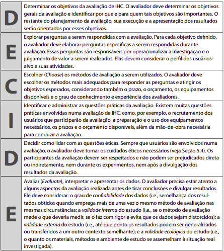
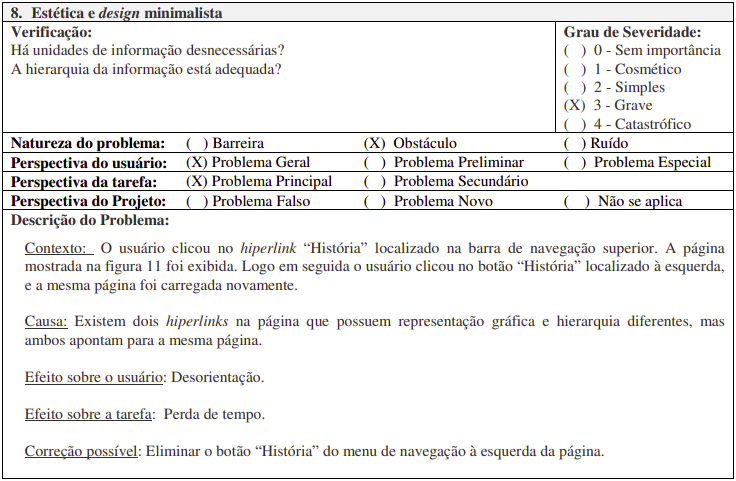

# Site escolhido

   
   <figcaption> Faculdade de Arquitetura e Urbanismo </figcaption>

***

### Histórico de Versões

**Data** | **Versão** | **Descrição** | **Autor(es/as)** | **Revisor**|
--- | --- | --- | --- | --- |
08/07/2022 | 0.1 | Criação do documento e descrição de tópico introdutório _Avaliação_ | Matheus Costa | Caio César |
09/07/2022 | 0.2 | Adição dos tópicos _Objetivos_ e _Método de avaliação_ | Matheus Costa | Letícia Aires
18/07/2022 | 0.3 | Adição do tópico da _Avaliação Heurísitca_ | Matheus Costa | Caio César
19/07/2022 | 0.3.1 | Adição dos subtópicos _Modelo de avaliação_ e _Avaliação do site_ | Matheus Costa | Caio César

## Introdução
A avaliação do site foi feita com base no _framework_ DECIDE (imagem 1), proposto por Sharp, Rogers e Preece (2007) para auxiliar no processo de uma avaliação de IHC (BARBOSA; SILVA; 2010, p. 312).

Ele basicamente estabelece que é preciso determinar os **objetivos** da avaliação, em seguida escolher **métodos de avaliação** adequados, **identificar** as questões práticas envolvidas, como perfis dos usuários e um escopo de avaliação definido, e por fim **avaliar** os dados.

   
   <figcaption> Imagem 1: Framework DECIDE </figcaption>

## 1. Objetivos

Durante o processo de avaliação de IHC é importante definir alguns dos **objetivos** da avaliação, pois são eles que irão determinar quais aspectos relacionados ao uso do sistema devem ser observados. Esses objetivos geralmente são detalhados por meio de perguntas a serem respondidas.

Dentre os objetivos estabelecidos temos:

- Identificar problemas na interação com o sistema.
- Analisar se o usuário consegue atingir seus objetivos.
- Se há uma conformidade com um padrão.

Algumas perguntas a serem respondidas:

- A interface do sistema é intuitiva?
- O usuário consegue atingir seu objetivo com facilidade?
- Os links da página redirecionam para um local esperado?
- O usuário possui controle sobre o sistema?
- Existe alguma ideia alternativa de design?

## 2. Método de avaliação
Para a escolha do método de avaliação, consideramos uma metodologia do tipo por **inspeção**, que, de acordo com Barbosa e Silva (2010), é um tipo que permite ao avaliador examinar (ou inspecionar) uma solução de IHC para tentar antever as possíveis consequências de certas decisões de design sobre as experiências de uso, além de que, costumeiramente, métodos de avaliação desse tipo são mais rápidos e de custo de execução mais baixo se comparados a outros métodos como os de investigação e de observação. (BARBOSA; SILVA; 2010, p. 302).

Escolhido o tipo da metodologia, a execução da avaliação foi feita por meio de uma **Avaliação Heurística**, que é um método baseado na verificação de uma lista de princípios (heurísticas) de usabilidade, propostos por Nielsen, no qual os avaliadores visam, de forma fácil e rápida, descobrir grandes problemas potenciais da interface. (MACIEL _et al._, 2004, p. 6)

## 3. Avaliação Heurística

Como citado anteriormente, segundo Preece, Rogers e Sharp (2005, p. 48-49), Nielsen propôs alguns princípios de usabilidade, que são usados como base para avaliação de algum sistema. Ao todo foram propostos 10 princípios, os quais são: 

- **Visibilidade** do status do sistema: manter o usuário informado sobre o que está acontecendo, sempre passando um _feedback_; 

- **Compatibilidade do sistema**: o sistema deve possuir uma linguagem que o usuário entenda;  

- **Controle do usuário e liberdade**: o usuário deve possuir liberdade para sair de um lugar indesejado e retornar a um estado anterior, sem ter que passar por um processo muito longo e utilizando "saídas de emergência" claramente identificadas;  

- **Consistência e padrões**: evita fazer com que os usuários tenham que pensar se situações, palavras ou ações diferentes significam a mesma coisa, facilitando o aprendizado do usuário, através de interfaces que apresentam operações similares para usos similares em tarefas similares;  

- **Reconhecer, diagnosticar e corrigir erros**: ajudar o usuário por meio de linguagem clara, como em mensagens de erro por exemplo, indicando o problema e sugerindo uma solução;  

- **Prevenção de erros**: oferecer um design cuidadoso, que ajude a prevenir algum erro;  

- **Reconhecimento**: ao invés de memorizar alguma informação, o usuário deve ter as instruções à sua disposição de forma bem visível e facilmente recuperável;  

- **Flexibilidade e eficiência**: permitir atalhos para ações mais frequentes, aumentando a velocidade;  

- **Estética e design minimalista**: evitar informações irrelevantes, que muitas vezes podem comprometer a visibilidade de informações relevantes;  

- **Ajuda e documentação**: informações devem ser fáceis de encontrar e ajuda mediante uma série de passos concretos que podem ser facilmente seguidos.

### 3.1. Modelo de avaliação

A avaliação aproveitou um modelo de formulário proposto por Maciel _et al_. (2004, p. 13) que avalia um problema de usabilidade por meio de uma série de tópicos, os quais recebem uma classificação que ajudam a descrever o problema. O modelo pode ser visualizado na Figura 1 abaixo.

   
   <figcaption> Figura 1: modelo de formulário</figcaption>

### 3.2. Avaliação do site

Para a avaliação do site da FAU, foram considerados os problemas de: compatibilidade do sistema, controle do usuário, consistência e padrões e estética e design minimalista. É possível observar que nas tabelas de 1 a 5 a seguir estão registradas as avaliações.

#### - Compatibilidade
<h6 align = "center">Tabela 1: avaliação sobre compatibilidade do sistema</h6>
Compatibilidade|  |
---|---|
Verificação:         | O site apresenta uma linguagem de fácil entendimento?   O usuário consegue atingir seu objetivo com facilidade? |
Grau de severidade:  | Simples. |
Perspectiva da tarefa: | Secundária. |
Contexto:            | O usuário deseja saber os nomes dos integrantes do corpo diretor da faculdade. |
Causa:               | A aba onde é possível identificar essas pessoas é denomindada "Quem é quem" e não possui um nome muito siginificativo. |
Efeito sobre usuário: | Acaba gerando uma certa desorientação, podendo fazer com que o usuário leve mais tempo do que o necessário para achar esses dados. |
Efeito sobre tarefa: | Pode gerar perda de tempo. |
Correção possível:   | Alterar o nome da aba para "Coordenação" ou "Corpo docente" pode trazer mais significância. |

#### - Controle do usuário
<h6 align = "center">Tabela 2: avaliação sobre controle do usuário</h6>
Controle do usuário | |
---|---|
Verificação:         | O usuário possui controle sobre o sistema? |
Grau de severidade:  | Simples. |
Perspectiva da tarefa: | Principal. |
Contexto:            | Usuário clica em algum hiperlink. |
Causa:               | Após o _click_ é aberta uma outra página fora do domínio do site da FAU mas na mesma guia do navegador. |
Efeito sobre usuário: | Caso seja aberta uma página muito diferente da página principal, acaba se tornando exaustivo para o usuário ter que retornar sempre à página anterior. |
Efeito sobre tarefa: | Trabalho adicional. |
Correção possível:   | Mostrar as informações na mesma página ou estar apresentado de forma mais clara que o usuário será redirecionado na mesma aba da questão. |

#### - Consistência e padrões

<h6 align = "center">Tabela 3: avaliação sobre consistência e padrões</h6>
Consistência e padrões |  |
---|---|
Verificação:         | Os links da página redirecionam para um local esperado? |
Grau de severidade:  | Grave. |
Perspectiva da tarefa: | Principal. |
Contexto:            | O usuário está navegando pelo menu lateral de "Estrutura". |
Causa:               | Alguns subtópicos clicáveis das seções "Instâncias" e "Secretarias" (que aparecem em sequência) mostram informações dentro da página da FAU, porém outros acabam abrindo uma outra página, fugindo de um padrão. |
Efeito sobre usuário: | Gera uma quebra de expectativa no usuário. |
Efeito sobre tarefa: | Trabalho adicional. |
Correção possível:   | Manter os dados no mesmo local da página. |

<h6 align = "center">Tabela 4: avaliação 2 sobre consistência e padrões</h6>
Consistência e padrões |  |
----|----|
Verificação:         | A interface é intuitiva? |
Grau de severidade:  | Grave. |
Perspectiva da tarefa: | Principal. |
Contexto:            | O usuário passa o mouse por cima de um componente na página. |
Causa:               | Alguns desses componentes dão a entender que são clicáveis e que ao serem clicados apresentarão informações condizentes com o que o componente indica, mas no fim acabam não realizando nenhuma ação. |
Efeito sobre usuário: | Desorientação. |
Efeito sobre tarefa: | Perda de tempo. |
Correção possível:   | Desabilitar a indicação de componente clicável. |

#### - Estética e design minimalista

<h6 align = "center">Tabela 5: avaliação sobre estética e design minimalista</h6>
Estética e design minimalista |  | 
---|---|
Verificação:      |    Existe alguma informação irrelevante?   Exite alguma alternativa de design? |
Grau de severidade:  | Cosmético. |
Perspectiva da tarefa: | Principal. |
Contexto:            | O usuário deseja saber das notícias mais recentes. |
Causa:               | No menu principal existe uma opção denominada "Notícias", mas quando ela é clicada, é aberta uma outra página com um design completamente diferente do da página principal da FAU, referente ao "LaSUS - Laboratório de Sustentabilidade Aplicada à Arquitetura e ao Urbanismo".   Em contrapartida, o componente que redireciona à seção de notícias (de fato), pois possui uma estética semelhante à de anúncios em uma página, algo que  usuário tende a ignorar. |
Efeito sobre usuário: | Hesitação. |
Efeito sobre tarefa: | Trabalho adicional. |
Correção possível:   | Agrupar as notícias na aba com melhor visualização. |

## Referências
> BARBOSA, Simone; SILVA, Bruno. **Interação Humano-Computador**. 1ª Edição. Elsevier, 2010.

> MACIEL, Cristiano _et al_. **Avaliação Heurística de Sítios na Web**. Instituto de Computação - Universidade Federal Fluminense (UFF), 2004. Disponível em: [docplayer.com.br/1827066-Avaliacao-heuristica-de-sitios-na-web.html](https://docplayer.com.br/1827066-Avaliacao-heuristica-de-sitios-na-web.html). Acesso em: 09 de jul. de 2022.

> PREECE, Jennifer; ROGERS, Yvonne; SHARP, Helen. O que é _Desing_ de Interação?. **Design de Interação: Além da Interação Humano-Computador**. 1ª Edição. Bookman, 2005.

