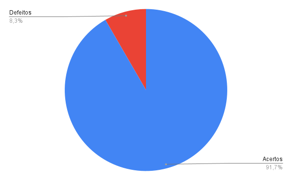

# Verificação - Cronograma de atividades
***

### Histórico de Versões

**Data** | **Versão** | **Descrição** | **Autor(es/as)** | **Revisor** |
--- | --- | --- | --- | --- |
03/09/2022 | 0.1 | Criação e desenvolvimento do Documento | Thalisson | Matheus Costa 

## 1. Introdução

Neste documento estão contidos os resultados obtidos da verificação do artefato [Cronograma de atividades](../planejamento/cronograma-de-atividades.md), seguindo os passos previstos no [planejamento](planejamento-geral.md).

* O artefato foi desenvolvido pelo integrante Caio César.

* A verificação foi feita pelo integrante Thalisson.

## 2. Preparação

Para a realização da Inspeção foi elaborado um checklist contendo algumas perguntas condizentes com o contexto do artefato, buscando analisar se o mesmo atendeu critérios que verificam a qualidade da sua entrega.

As perguntas são de cunho objetivo e as respostas seguem o seguinte padrão:

Caso o artefato atenda o que está sendo requisitado pela pergunta, haverá um ícone indicando que foi atendido, do contrário, também haverá um ícone indicando o seu descumprimento, conforme a legenda abaixo:

- ✅: Atendido.
- ❌: Não atendido.

## 3. Inspeção

As perguntas foram elaboradas considerando os conteúdos aprendidos ao longo da disciplina, considerações feitas pelo professor e pelo monitor da disciplina.

O checklist do artefato pode ser visualizado na Tabela 1 abaixo.

ID | Questão | Inspeção
--- | --- | ---
1  | Possui versionamento? | ✅
2  | Está gramaticalmente correto? | ✅
3  | Possui introdução? | ✅
4  | As imagens/figuras/tabelas possuem legenda? | ✅
5  | O objetivo do artefato está claro? | ✅
6  | Possui os horários de disponibilidade de todos os integrantes? | ✅
7  | Todas as tabelas de divisão de atividades possuem o integrante que realizou a atividade? | ✅
8  | Todas as tabelas de divisão de atividades possuem o integrante que revisou a atividade? | ✅
9  | Todas as tabelas de divisão de atividades possuem a atividade que está sendo realizada? | ✅
10 | Todas as tabelas de divisão de atividades possuem data limite para conclusão da atividade? | ✅
11 | Todas as tabelas de divisão de atividades possuem data limite para conclusão da revisão? | ✅
12 | A atividade de gravação e edição de vídeo está prevista em todas as entregas? | ❌

<h6 align = "center">Tabela 1: checklist do Cronograma de atividades Fonte: Autores. </h6>

## 4. Acompanhamento
### 4.1. Porcentagem de sucesso da checklist

- 1 ERROS e 11 ACERTOS
- 91,7% de acertos.

### 4.2. Gráfico de acompanhamento

A Figura 1 abaixo revela o gráfico gerado com os dados do acompanhamento.

<h6 align = "center">Figura 1: gráfico do checklist da verificação Fonte: Autores. </h6>

## 5. Correção

Após a etapa de Inspeção, foram observados que nem todas as atividades estavam detalhadas no planejamento das atividades. Para corrigir o artefato e deixá-lo mais coerente e padronizado, deve-se adicionar essas atividades que estão faltando.

## 6. Referências

> Barbosa, S. D. J.; Silva, B. S. da; Silveira, M. S.; Gasparini, I.; Darin, T.; Barbosa, G. D. J. (2021) - Interação Humano-Computador e Experiência do usuário.
