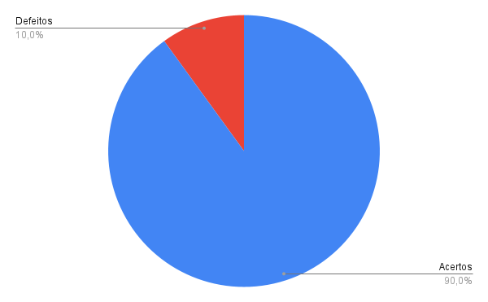

***

### Histórico de Versões

**Data** | **Versão** | **Descrição** | **Autor(es/as)** | **Revisor** |
--- | --- | --- | --- | --- |
22/08/2022 | 0.1 | Criação do Documento | Thalisson | Matheus Costa 
22/08/2022 | 0.2 | Desenvolvimento do Documento | Thalisson | Matheus Costa

## 1. Introdução

A inspeção do [Planejamento da avaliação do Storyboard](../designAvalEDesenv/nivel1/storyboard/planejamento-da-avaliacao-do-storyboard.md) possibilita verificar como o _storyboard_ foi criado a fim de encontrar possíveis defeitos para que eles sejam corrigidos e fiquem mais coerentes com o artefato.

## 2. Metodologia

Para a realização das verificações vamos utilizar um _checklist_ com algumas perguntas referentes ao artefato em questão. Caso a resposta para uma determinada pergunta do _checklist_ seja positiva marcaremos com um _ok_, caso contrário terá um _X_. Conforme a legenda abaixo:

- ✅: Atendido.
- ❌: Não atendido.

Após a verificação do artefato, ele será corrigido e com isso desenvolveremos uma nova versão da _checklist_ referente a segunda versão do artefato.

## 3. Verificação

### 3.1. Checklist

ID | Questão | Inspeção
--- | --- | ---
1 | Possui versionamento? | ✅
2 | Está gramaticalmente correto? | ✅
3 | Possui introdução? | ✅
4 | As imagens/figuras/tabelas possuem legenda? | ✅
5 | O objetivo está claro? | ✅
6 | Possui conclusão? | ✅
7 | A aplicação da avaliação está clara? | ✅
8 | As perguntas foram definidas? | ✅

## 4. Correção

Neste documento não foram encontrados defeitos após a realização da inspeção, sendo assim não será necessário produzir uma segunda versão do artefato.

## 5. Acompanhamento
### 5.1. Porcentagem de sucesso da checklist

- 0 Defeitos
- 8 Acertos
- 100% de acertos

### 5.2. Gráfico de acompanhamento

<h6 align = "center">Gráfico 1: gráfico de acertos vs defeitos  Fonte: Autores. </h6>

## 6. Referências

> [1] Barbosa, S. D. J.; Silva, B. S. da; Silveira, M. S.; Gasparini, I.; Darin, T.; Barbosa, G. D. J. (2021) - Interação Humano-Computador e Experiência do usuário.
