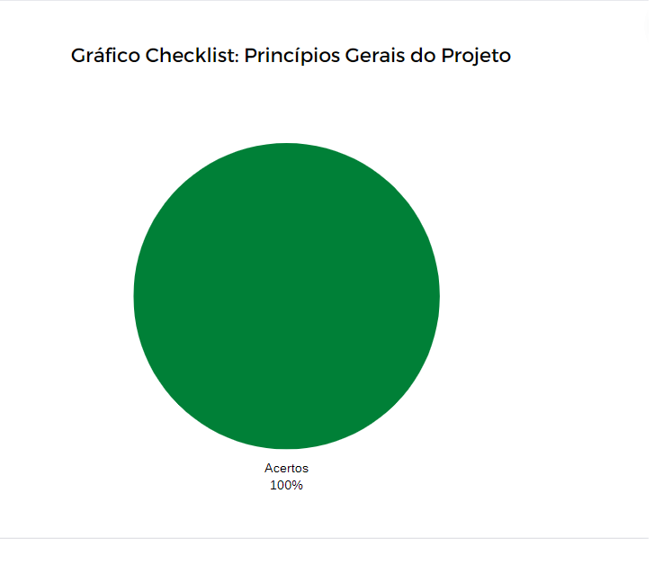

# Verificação - Princípios Gerais do Projeto
***

### Histórico de Versões

**Data** | **Versão** | **Descrição** | **Autor(es/as)** | **Revisor** |
--- | --- | --- | --- | --- |
22/08/2022 | 0.1 | Criação do Documento | Mateus Franco | Letícia Aires
22/08/2022 | 0.2 | Adição do corpo do texto | Mateus Franco | Letícia Aires

## 1. Introdução

Neste documento estão contidos os resultados obtidos da verificação do artefato [Principios Gerais](../analise-de-requisitos/principios-gerais.md), seguindo os passos previstos no [planejamento](planejamento-geral.md).

* O artefato foi desenvolvido pelo integrante Matheus Costa.

* A verificação foi feita pelo integrante Mateus Franco.

## 2. Preparação

Para a realização da Inspeção foi elaborado um checklist contendo algumas perguntas condizentes com o contexto do artefato, buscando analisar se o mesmo atendeu critérios que verificam a qualidade da sua entrega.

As perguntas são de cunho objetivo e as respostas seguem o seguinte padrão:

Caso o artefato atenda o que está sendo requisitado pela pergunta, haverá um ícone indicando que foi atendido, do contrário, também haverá um ícone indicando o seu descumprimento, conforme a legenda abaixo:

- ✅ : Atendido
- ❌ : Não Atendido

## 3. Inspeção

As perguntas foram elaboradas considerando os conteúdos aprendidos ao longo da disciplina, considerações feitas pelo professor e pelo monitor da disciplina.

O checklist do artefato pode ser visualizado na Tabela 1 abaixo.

|ID|Pergunta| Verificação |
|:---:|-------------|:--------:|
| 1 | O documento está gramaticalmente correto? | ✅|
| 2 | O documento possui versionamento? | ✅|
| 3 | Existe uma introdução ao conceito abordado?| ✅|
| 4 | O projeto possui princípios e diretrizes de design? |✅ |
| 5 | Os princípios e diretrizes são de fácil e rápido entendimento?| ✅|
| 6 | Os princípios e diretrizes são aplicáveis a outros artefatos?| ✅|
| 7 | Os princípios e diretrizes possuem referências?| ✅|

<h6 align = "center">Tabela 1: checklist dos Princípios Gerais do Projeto  Fonte: Autores. </h6>

## 4. Acompanhamento

- 0 ERROS e 7 ACERTOS
- 100% de acerto.

### 4.1. Gráfico de acompanhamento

A Figura 1 abaixo revela o gráfico gerado com os dados do acompanhamento.

<h6 align = "center">Figura 1: gráfico do checklist dos Princípios Gerais do Projeto  Fonte: Autores. </h6>

## 5. Correção

Após a etapa de Inspeção dos Princípios Gerais do Projeto, foi observado que o documento atendeu de forma coerente os artefatos e critérios determinados para o cumprimento do objetivo.

## 6. Referências

> [1] SERRANO, M.; SERRANO, M. Material de aula. **Requisitos - Aula 023 - Verificação e Validação**.