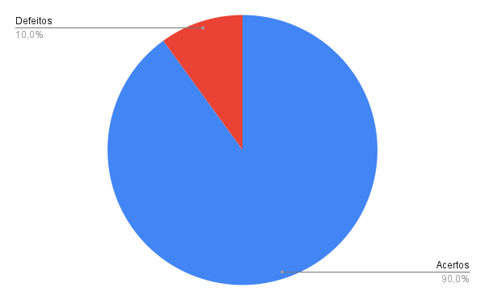

# Verificação - Relato dos resultados da avaliação do Storyboard
***

### Histórico de Versões

**Data** | **Versão** | **Descrição** | **Autor(es/as)** | **Revisor** |
--- | --- | --- | --- | --- |
22/08/2022 | 0.1 | Criação do Documento | Thalisson | Matheus Costa 
22/08/2022 | 0.2 | Desenvolvimento do Documento | Thalisson | Matheus Costa

## 1. Introdução

Neste documento estão contidos os resultados obtidos da verificação do artefato [Relato do Storyboard](../designAvalEDesenv/nivel1/storyboard/relato-da-avalia%C3%A7%C3%A3o-do-storyboard.md), seguindo os passos previstos no [planejamento](planejamento-geral.md).

* O artefato foi desenvolvido pelo integrante Caio César.

* A verificação foi feita pelo integrante Thalisson.

## 2. Preparação

Para a realização da Inspeção foi elaborado um checklist contendo algumas perguntas condizentes com o contexto do artefato, buscando analisar se o mesmo atendeu critérios que verificam a qualidade da sua entrega.

As perguntas são de cunho objetivo e as respostas seguem o seguinte padrão:

Caso o artefato atenda o que está sendo requisitado pela pergunta, haverá um ícone indicando que foi atendido, do contrário, também haverá um ícone indicando o seu descumprimento, conforme a legenda abaixo:

- ✅: Atendido.
- ❌: Não atendido.

## 3. Inspeção

As perguntas foram elaboradas considerando os conteúdos aprendidos ao longo da disciplina, considerações feitas pelo professor e pelo monitor da disciplina.

O checklist do artefato pode ser visualizado na Tabela 1 abaixo.

ID | Questão | Inspeção
--- | --- | ---
1 | Possui versionamento? | ✅
2 | Está gramaticalmente correto? | ✅
3 | Possui introdução? | ✅
4 | As imagens/figuras/tabelas possuem legenda? | ✅
5 | O objetivo está claro? | ✅
6 | Possui conclusão? | ✅
7 | A metodologia da avaliação é explicado claramente? | ✅
8 | A metodologia condiz com a pré-estabelecida no planejamento? | ❌
9 | Possui referências bibliográficas? | ✅
10 | Possui as respostas dos entrevistados? | ✅

<h6 align = "center">Tabela 1: checklist do relato da avaliação do Storyboard Fonte: Autores. </h6>

## 4. Acompanhamento
### 4.1. Porcentagem de sucesso da checklist

- 1 ERROS e 9 ACERTOS
- 90% de acertos.

### 4.2. Gráfico de acompanhamento

A Figura 1 abaixo revela o gráfico gerado com os dados do acompanhamento.

<h6 align = "center">Figura 1: gráfico do checklist da verificação do relato Fonte: Autores. </h6>

## 5. Correção

Após a etapa de Inspeção, foram observados que a metodologia aplicada no relato do storyboard não coincide com a pré-estabelecida no planejamento. Para corrigir o artefato e deixá-lo mais coerente, deve-se fazer esse ajuste atualizando o planejamento para a metodologia que realmente foi utilizada.

## 6. Referências

> Barbosa, S. D. J.; Silva, B. S. da; Silveira, M. S.; Gasparini, I.; Darin, T.; Barbosa, G. D. J. (2021) - Interação Humano-Computador e Experiência do usuário.
